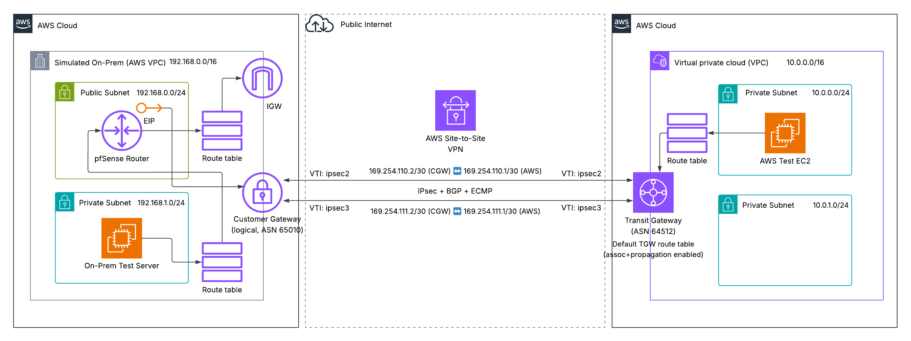
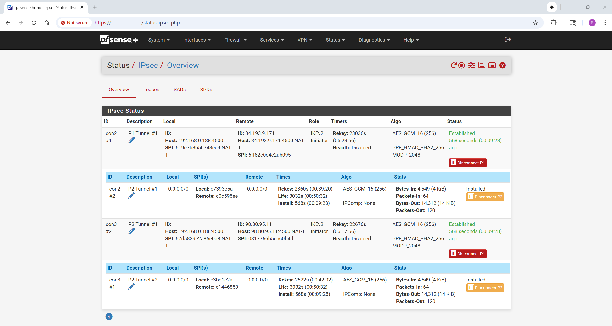
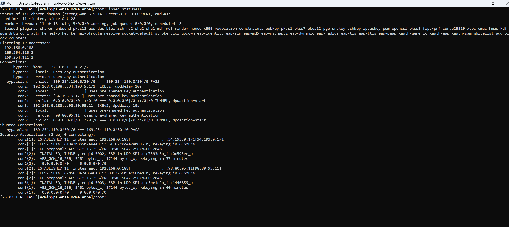
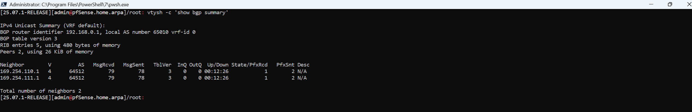
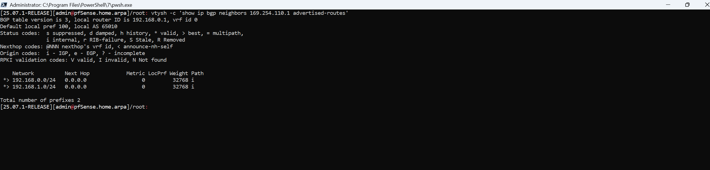
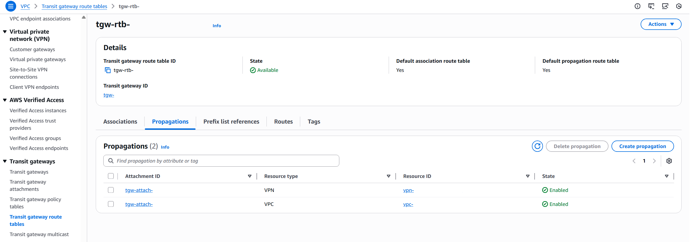
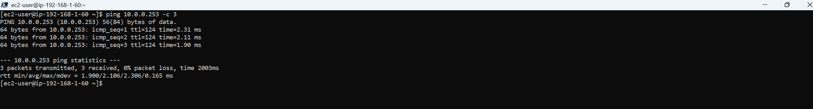
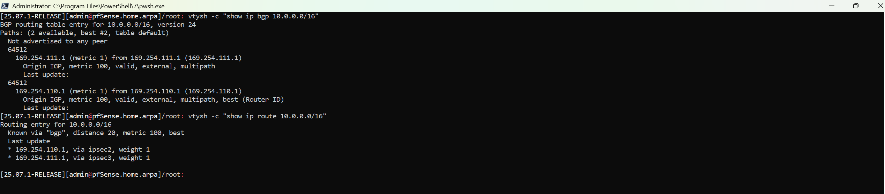

# AWS TGW Site-to-Site VPN (pfSense)  
A **Transit Gateway–based** Site-to-Site VPN that simulates an on-prem network using a **pfSense** router (EC2) and a private on-prem server, and connects it to an **AWS VPC** over **two IPsec tunnels** with **BGP (FRR)** and **ECMP**. All AWS resources are deployed via a single **CloudFormation** template. The exact **pfSense** GUI steps to bring up the VPN and verify routing end-to-end are provided. After deployment and setup, the **IPsec** tunnels are **Established/Installed**, BGP neighbors are **Established** with **PfxRcd=1 / PfxSnt=2**, and pings to the AWS private instance succeed via the TGW.  

## Architecture Overview  
  
*Figure 1: Architecture diagram of the TGW Site-to-Site VPN with pfSense (simulated on-prem) and ECMP over two IPsec tunnels*  

- **AWS VPC (10.0.0.0/16)** – Two subnets host the **TGW VPC attachment** and a private **test EC2** instance.  
- **AWS Transit Gateway (ASN 64512)** – Central routing hub; **default association/propagation** enabled. The VPN terminates on a Transit Gateway so multiple VPCs and sites can share a central routing hub without point-to-point sprawl.  
- **Site-to-Site VPN (2 tunnels)** – **IKEv2**, AES-GCM/SHA2, DH 14/16, **NAT-T** on UDP/4500.  
- **pfSense (ASN 65010)** – Acts as **Customer Gateway**; two **VTI/route-based** Phase 2s:  
    - **Tunnel 1:** CGW inside `169.254.110.2/30` ↔ AWS inside `169.254.110.1/30`  
	- **Tunnel 2:** CGW inside `169.254.111.2/30` ↔ AWS inside `169.254.111.1/30`  
- **BGP (FRR on pfSense)** – Neighbors `169.254.110.1` & `169.254.111.1` exchange routes; on-prem advertises `192.168.0.0/24` and `192.168.1.0/24`, learns `10.0.0.0/16` from AWS.  
- **ECMP** – pfSense learns `10.0.0.0/16` with two `equal-cost next hops` (both tunnels) for resilience.  

## Skills Applied  
- Designing **TGW-centric** hybrid connectivity with **dual-tunnel IPsec** and **BGP**.  
- Implementing **route-based (VTI)** IPsec on pfSense to support dynamic routing.  
- Configuring **FRR BGP** on pfSense (neighbors, prefix-lists, outbound filtering).  
- Enforcing **least-privilege** security groups (IKE/NAT-T/WAN UI, BGP/ICMP on IPsec).  
- Using **CloudFormation** parameters/conditions to toggle a simulated on-prem.  
- Verifying **ECMP**, control plane (**BGP**) and data plane (**ICMP ping**) health.  

## Features  
- **TGW-based VPN hub** - Uses a Transit Gateway (ASN 64512) so additional VPCs/on-prem sites can be attached without redesign.  
- **Dual-tunnel IPsec + BGP** - Two independent IPsec tunnels, each with its own eBGP session for fast convergence.  
- **ECMP load sharing** - `10.0.0.0/16` is learned with two equal-cost next-hops; pfSense performs per-flow load sharing.  
- **Clean BGP policy** - Prefix-lists limit outbound to `192.168.0.0/24` and `192.168.1.0/24` and inbound to `10.0.0.0/16`.  
- **Route-based (VTI) IPsec** - No policy-based rules; dynamic routing over VTIs keeps the config simple and scalable.  
- **Least-privilege security groups** - Scoped WAN access to pfSense UI/SSH via `AdminCidr`; ICMP/BGP permitted on IPsec only.  
- **Parametrized IaC** - One CloudFormation template with toggles for simulated on-prem, PSKs, and accelerated VPN.  
- **Proven end-to-end validation** - Screenshots and commands confirm IPsec SAs, BGP adjacencies, TGW propagations, and ping success.  

## Tech Stack  
- **AWS Services:** Customer Gateway (CGW), EC2, EIP, IAM, Route Tables, Security Groups, Site-to-Site VPN, Subnets, Transit Gateway (TGW), VPC  
- **IaC Tool:** AWS CloudFormation  
- **Other Tools:** AWS CLI, Windows OpenSSH (PowerShell), pfSense UI/CLI  

## Deployment Instructions  
> **Note:** All examples use `PowerShell` syntax. On bash, replace backticks ``(`)`` with `\` or put all arguments on one line.  

1. In the AMI Catalog in the AWS Management Console, subscribe to Netgate pfSense Plus (x86_64) in your Region and copy the AMI ID. This will be used for the OnPremAmiId parameter when deploying via CloudFormation.  

### CloudFormation  
2. Clone this repository.  

3. Edit the `template.yaml` file to customize the deployment.  
   - `ProjectName`: Controls the naming of resources created in the template.  
   - `SimulateOnPrem`: If `true`, deploys a simulated on-prem environment (pfSense + private server).  
   - `AdminCidr`: Your public /32 IP address used to allow pfSense UI/SSH access.  
   - `KeyPairName`: EC2 key pair for pfSense/on-prem server SSH (optional, but recommended). Create under EC2 → Key Pairs.  
   - `OnPremAmiId`: Netgate pfSense AMI ID for your region (from Step 1).  
   - `ProvidePsks`: If `false` (default), AWS generates PSKs; if `true`, supply `Tunnel1Psk` and `Tunnel2Psk`.  
   - `EnableAcceleration`: Enables AWS Accelerated VPN (uses nearby AWS edge via Global Accelerator).  

4. Deploy the CloudFormation stack:  
    ```powershell
	cd cloudformation
	aws cloudformation deploy `
	--stack-name s2s-tgw-sim `
	--template-file template.yaml `
	--capabilities CAPABILITY_NAMED_IAM `
	--parameter-overrides `
		ProjectName=s2s-tgw-sim `
		SimulateOnPrem=true `
		AdminCidr=<YOUR_PUBLIC_IP>/32 `
		KeyPairName=<YOUR_KEYPAIR_NAME> `
		OnPremAmiId=<PFSENSE_AMI_ID> `
		ProvidePsks=false `
		EnableAcceleration=false
	```

5. Collect stack outputs:  
	```powershell
	aws cloudformation describe-stacks `
	--stack-name s2s-tgw-sim `
	--query "Stacks[0].Outputs[*].[OutputKey,OutputValue]" `
	--output table
	```
	
6. Download AWS VPN configuration from Console → VPC → Site-to-Site VPN connections → your **VpnConnectionId** → **Download configuration** (Generic / IKEv2). Note for each tunnel:  
    - **AWS outside IPs** (the TGW endpoint public IPs; e.g., `34.193.9.171`, `98.80.95.11`)  
	- **PSKs** (if AWS-generated)  
	- **Inside /30s** and **BGP neighbors** (e.g., `169.254.110.1` / `169.254.111.1`), **ASNs** (e.g., AWS `64512`, Customer `65010`)  

7. Open **OnPremRouterUiUrl** and log into **pfSense** UI. Retrieve the initial **admin** password via either:  
	- EC2 Console → Instances → Select your pfSense instance (e.g., s2s-tgw-sim-onprem-router) → Actions → Monitor and troubleshoot → **Get system log**; search for the line that prints the random admin password.  
	- SSH to the instance console, select **(8) Shell**, and run `cat /etc/motd-passwd` to print the current admin password.  

8. Configure IPsec (two tunnels). Complete the Phase 1 and Phase 2 configuration for each tunnel. The default settings can be used for any setting not mentioned. Navigate to pfSense → VPN → IPsec → Tunnels.  
    - **Phase 1**- Select **Add P1**  
		- **Description:** Name of tunnel (e.g., P1 Tunnel #1)  
		- **Key Exchange:** IKEv2  
		- **Internet Protocol:** IPv4  
		- **Interface:** WAN  
		- **Remote Gateway:** Outside IP address of Virtual Private Gateway from VPN configuration (tunnel-specific)  
		- **Authentication Method:** Mutual PSK  
		- **My identifier:** IP address → Outside IP address of Customer Gateway from VPN configuration  
		- **Peer identifier:** IP address → Outside IP address of Virtual Private Gateway from VPN configuration (tunnel-specific)  
		- **Pre-Shared Key:** from AWS VPN config (or your own)  
		- **Encryption Algorithm:** Algorithm- AES256-GCM, Key length- 128 bits, Hash- SHA256, DH Group- 14 (2048 bit). The “128” shown for GCM is the integrity check value (ICV), not the AES key length. The cipher is AES-256.  
		- **NAT Traversal:** Auto  
		- **Dead Peer Detection:** Enable DPD  
		- Click **Save** to save the configuration.  
	- **Phase 2**- Select **Show Phase 2 Entries (0)** → **Add P2**  
		- **Tunnel:**  
			- **Description:** Name of tunnel (e.g., P2 Tunnel #1)  
			- **Mode:** Routed (VTI)  
			- **Local Network:** Address- Inside IP Address of Customer Gateway from VPN configuration (tunnel-specific)  
			- **Remote Network:** Address- Inside IP Address of Virtual Private Gateway from VPN configuration (tunnel-specific)  
			- **Protocol:** ESP  
			- **Encryption Algorithm:** Check only AES256-GCM- 128 bits  
			- **PFS key group:** 14 (2048 bit)  
			- Click **Save** to save the configuration.  
	- Click **Apply Changes** at the top of the Tunnels page.  
	- **Verify:** Status → IPsec shows **Phase 1 Established** + **Phase 2 Installed** for both tunnels.  
	
9. 	Configure Interface Assignments. Navigate to pfSense → Interfaces → Assignments.  
	- **Add:** ipsec2 (IPsec VTI)  
		- Select the interface, Select **Enable**, enter a name (e.g., ipsec2), and set MTU to 1436. VTIs do not need addresses in pfSense.  
		- Ensure the checkboxes in the Reserved Networks section are left unchecked.  
		- Click **Save** to save the configuration.  
		- Click **Apply Changes**.  
	- **Add:** ipsec3 (IPsec VTI)  
		- Select the interface, Select **Enable**, enter a name (e.g., ipsec3), and set MTU to 1436. VTIs do not need addresses in pfSense.  
		- Ensure the checkboxes in the Reserved Networks section are left unchecked.  
		- Click **Save** to save the configuration.  
		- Click **Apply Changes**.  
	- Under the **WAN** interface, uncheck all options under the Reserved Networks section, **Save**, and **Apply Changes**.  
	
10. Configure firewall rules (**BGP/ICMP/NAT**).  
	- Navigate to pfSense → Firewall → Rules → IPsec.  
		- **Add:** **TCP 179** (BGP)- Action: Pass, Interface: IPsec, Protocol: TCP, Source: Any, Destination Port Range: From **BGP (179)** To **BGP(179)**. **Save**.  
		- **Add:** **ICMP**- Action: Pass, Interface: IPsec, Protocol: ICMP, ICMP Subtypes: Any, Source: Network- 192.168.1.0/24, Destination: 10.0.0.0/16. **Save**.  
		- Click ** Apply Changes** at the top of the IPsec Firewall Rules page.  
	- Navigate to pfSense → Firewall → Rules → Floating  
		- Add a **Quick** pass rule on **WAN**- Direction: In, Protocol: ICMP, Source: 192.168.1.0/24, Destination: 10.0.0.0/16, Disable reply-to checked, Log enabled. **Save** and **Apply Changes**.
	- **NAT note:** With route-based (VTI) IPsec, on-prem ↔ VPC traffic must **not** be NATed. Leave Outbound NAT in its default mode or, if you use Manual/Hybrid, ensure there’s a top-of-list **Do not NAT** rule for 192.168.1.0/24 → 10.0.0.0/16.  

11. Enable **FRR** and configure **BGP**.  
	- Navigate to System → Package Manager → Available Packages → Press **Install** for FRR → **Confirm**.  
	- Navigate to Services → FRR Global/Zebra  
		- Enable **FRR**. Enter the Master Password (same password used to log into the pfSense UI). **Save**.  
	- Navigate to Services → FRR BGP  
		- Enable **BGP** Routing  
		- **Local AS:** Customer Gateway ASN from VPN configuration (e.g., `65010`)  
		- **Router ID:** `192.168.0.1`  
		- **Networks to Distribute:** Add `192.168.0.0/24` and `192.168.1.0/24`. These will be advertised. **Save**.  
		- In the Advanced tab, ensure **Disable eBGP Require Policy** is unchecked.  
	- Prefix Lists (Services → FRR BGP → Global Settings → Prefix Lists). Add the following prefix lists. Use any ascending sequence numbers (e.g., 5, 10). Only the order matters.  
		- **LOCAL-ONLY**  
			- Seq 5, Action: Permit, Network: `192.168.0.0/24`  
			- Seq 10, Action: Permit, Network: `192.168.1.0/24`  
			- Click **Save** to save the configuration.  
		- **AWS-IN**  
			- Seq 10, Action: Permit, Network: `10.0.0.0/16`  
			- Click **Save** to save the configuration.  
	- Neighbors (Services → FRR BGP → Neighbors)  
		- Add Inside IP Addresses of Virtual Private Gateways from VPN configuration (e.g., `169.254.110.1` and `169.254.111.1`) with:  
			- **Remote AS:** Virtual Private Gateway ASN from VPN configuration (e.g., `64512`)  
			- **Prefix List Filter** Inbound: `IPv4: AWS-IN`  
			- **Prefix List Filter** Outbound: `IPv4: LOCAL-ONLY`  
		- **Save** both neighbors.  
	- **ECMP note:** If `show ip route 10.0.0.0/16` does not display two next-hops when testing, enable Services → FRR BGP → Advanced → Multipath Relax and apply. Most installs learn ECMP to TGW without additional tuning.  
	
**Note:** Ensure the AWS CLI user (`aws configure`) or CloudFormation assumed role is configured  with credentials that have sufficient permissions to manage **CloudWatch Logs**, **Customer Gateways**, **EC2**, **EIPs**, **Route Tables**, **Security Groups**, **Site-to-Site VPNs**, **Subnets**, **Transit Gateways**, **VPCs**, and **IAM resources**.  

## How to Use  
1. **Deploy the infrastructure** using CloudFormation and configure IPsec/BGP using the pfSense UI.  

2. **Perform Quick GUI checks (pfSense)**:  
	- Status → IPsec: Both tunnels show **Phase 1 Established** + **Phase 2 Installed**.  
	- Status → System logs → IPsec: No negotiation errors.  

3. **Perform control plane checks (pfSense shell):**  
	- Navigate to Diagnostics → Command Prompt → Execute Shell Command (or SSH to pfSense router) and run the following shell commands:  
		```bash
		# Check if tunnels are up. Expected: two IKE_SA + two CHILD_SA Established
		ipsec statusall
		
		# Check BGP neighbor health. Expected: two neighbors Established, PfxRcd = 1, and PfxSnt = 2.
		vtysh -c "show bgp summary"
		
		# Check what is advertised to AWS. Expected: 192.168.0.0/24 and 192.168.1.0/24 only.
		vtysh -c "show ip bgp neighbors 169.254.110.1 advertised-routes"
		vtysh -c "show ip bgp neighbors 169.254.111.1 advertised-routes"
		
		# Check what is accepted from AWS. Expected: 10.0.0.0/16 with two next-hops via ipsec2 and ipsec3 (ECMP).
		vtysh -c "show ip bgp 10.0.0.0/16"
		vtysh -c "show ip route 10.0.0.0/16"
		```

4. **Perform data plane test (ping):**  
	- Navigate to Diagnostics → Ping.  
		- **Source:** `WAN`  
		- **Host:** `AwsTestInstancePrivateIp` from stack outputs (e.g., 10.0.0.253).  
		- Expect replies (0% loss).  
	- Navigate to System → Advanced, check **Enable ssh-agent forwarding support**, and click **Save**. Ping the on-prem server (192.168.1.60) via an SSH jump through the pfSense router. Enter the admin password when prompted.
		```powershell
		ssh -J admin@<OnPremRouterEip> -i "C:\path\to\your\key.pem" ec2-user@<OnPremServerPrivateIp>
		
		# If your key is already loaded in ssh-agent:
		ssh -A -J admin@<OnPremRouterEip> ec2-user@<OnPremServerPrivateIp>
		
		ping <AwsTestInstancePrivateIp> -n 3
		```
		- Expect 0% loss and low RTTs.  

## Project Structure  
```plaintext
aws-tgw-site-to-site-vpn
├── assets/                              # Images, diagrams, screenshots
│   ├── architecture-diagram.png         # Project architecture diagram
│   ├── pfsense-ipsec-status.png         # P1/P2 Established/Installed
│   ├── ipsec-statusall.png       		 # CLI: ipsec statusall (Established)
│   ├── frr-bgp-summary.png 	         # CLI: show bgp summary (2 neighbors)
│   ├── frr-adv-routes.png         		 # CLI: advertised-routes (2 on-prem /24s)
│   ├── tgw-propagations.png     	     # AWS TGW route table propagations
│   ├── onprem-ping-aws.png         	 # CLI: ping 10.0.0.253 from 192.168.1.60
│   └── frr-bgp-route-lookup.png         # CLI: show ip bgp/route 10.0.0.0/16 (ECMP)
├── cloudformation/                      # CloudFormation template
│   └── template.yaml					 # Main CloudFormation template
├── LICENSE
├── README.md
└── .gitignore
```  

## Screenshots  
   

*Figure 2: Both Phase 1 and Phase 2 SAs are established/installed for the two VPN tunnels.*  

  

*Figure 3: CLI output confirming both IKE_SA and CHILD_SA are Established for Tunnel 1 and Tunnel 2.*  

  

*Figure 4: FRR BGP summary: two neighbors Established; each shows PfxRcd=1 and PfxSnt=2.*  

  

*Figure 5: Routes advertised to AWS over both neighbors: 192.168.0.0/24 and 192.168.1.0/24 only.*  

   

*Figure 6: TGW route table shows propagations from both the VPC and the VPN attachment.*  

  

*Figure 7: On-prem server (192.168.1.60) successfully pings AWS instance (10.0.0.253).*  



*Figure 8: FRR shows two valid eBGP paths to 10.0.0.0/16 (via 169.254.110.1 and 169.254.111.1), both marked multipath. The kernel installs both next hops over IPsec VTIs (ECMP). “Not advertised to any peer” is expected because the AWS VPC CIDR isn’t exported.*

## Future Enhancements   
- **Dynamic Failover Demos:** Toggle one tunnel down and capture BGP/route changes.  
- **CloudWatch Alarms:** VPN tunnel state + TGW metrics with SNS notifications.  
- **Automation:** pfSense API/backup to script P1/P2+BGP provisioning.  
- **IPv6 Inside-Tunnel** demo and larger prefix examples.  
- **Accelerated VPN** test matrix (NAT-T behavior, throughput notes).  

## License  
This project is licensed under the [MIT License](LICENSE).  

---

## Author  
**Patrick Heese**  
Cloud Administrator | Aspiring Cloud Engineer/Architect  
[LinkedIn Profile](https://www.linkedin.com/in/patrick-heese/) | [GitHub Profile](https://github.com/patrick-heese)  

## Acknowledgments  
This project was inspired by a course from [acantril](https://github.com/acantril/learn-cantrill-io-labs/tree/master/aws-simple-site2site-vpn).  
The architecture diagram included here is my own version, adapted from the original course diagram.  
I designed and developed all Infrastructure-as-Code (CloudFormation) and project documentation.  